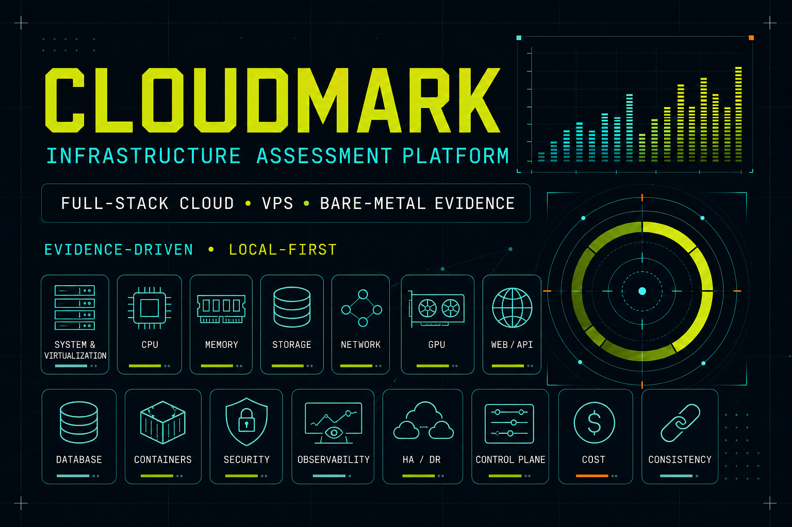

# CloudMark



CloudMark is an evidence-driven infrastructure assessment platform for cloud
instances, VPS, bare-metal servers, and self-hosted cloud environments. It
collects machine evidence, executes versioned benchmark profiles, preserves raw
results, and maps verified measurements to workload suitability.

CloudMark is designed for repeatable provider evaluation—not one-off speed
tests. Every conclusion must be traceable to a profile, tool version, topology,
timestamp, and raw result.

## Current capabilities

| Coverage | Capability |
|---|---|
| Available | Cross-platform inventory and system evidence |
| Available | AWS, Azure, and Google Cloud metadata detection |
| Available | Declared provider manifests for regional and self-hosted clouds |
| Available | Filesystem-safe `fio` storage profiles with latency percentiles |
| Available | Local Controller API, SQLite history, and responsive dashboard |
| Partial | Distributed agent registration and two-node topology pairing |
| Roadmap | Automated peer-to-peer network traffic executor |
| Roadmap | Remaining compute, memory, GPU, application, platform, operations, and provider executors |
| Roadmap | Final workload suitability and provider scoring engine |

`Partial` and `Roadmap` capabilities never receive an artificial zero score.
The dashboard reports insufficient evidence until the required executor and
measurements are available.

## Assessment scope

CloudMark is not a storage- or network-only benchmark. Its catalog spans the
full path from machine evidence to provider operations:

| Layer | Assessment domains |
|---|---|
| Foundation | System/hardware inventory, provider identity, virtualization and topology |
| Performance | CPU/compute, memory/NUMA, storage/filesystem/object, network/connectivity, GPU/accelerators |
| Application platform | Web/API/TLS, database/cache, containers/Kubernetes |
| Trust and operations | Security/isolation, reliability/HA/DR, observability/operations |
| Provider quality | Provisioning/control plane, cost/efficiency, consistency/noisy-neighbor behavior |

These 17 technical domains feed 12 workload suitability targets. A domain can
be `Available`, `Partial`, or `Roadmap`; only collected evidence may influence a
recommendation. See the [assessment catalog](docs/ASSESSMENT_CATALOG.vi.md) for
the planned measurements and minimum machine topology of every domain.

## Operating model

```text
Operator environment
└── CloudMark Controller + dashboard + result database

Provider environment
├── Agent A — system under assessment
└── Agent B — workload generator / peer
```

The Controller coordinates sessions and stores evidence. Provider throughput is
measured directly between agents; cloud-to-controller performance measurement
is disabled by policy.

## Quick start

Requirements: Python 3.9+, Node.js 22+, and pnpm.

```bash
python -m pip install -e .
pnpm install
```

Start the Controller:

```bash
python -m cloudmark serve --data-dir .cloudmark
```

Start the dashboard in a second terminal:

```bash
pnpm run dev
```

Open the local URL printed by the dashboard. Enter the token printed by the
Controller under **Controller key** before starting write operations.

## Assessment commands

```bash
python -m cloudmark inventory
python -m cloudmark doctor --packs storage,network,database,web
sudo python -m cloudmark bootstrap --packs storage,network,database,web --yes
python -m cloudmark run storage --profile disk-quick --yes
```

Storage runs use a temporary file, preserve a free-space reserve, never target
a raw device, and remove the test file after completion or failure.

## Documentation

- [Hướng dẫn sử dụng tiếng Việt](docs/USER_GUIDE.vi.md)
- [Danh mục đánh giá toàn diện](docs/ASSESSMENT_CATALOG.vi.md)
- [Architecture](docs/ARCHITECTURE.md)
- [API](docs/API.md)
- [Disk methodology](docs/DISK_METHODOLOGY.md)
- [Network methodology](docs/NETWORK_METHODOLOGY.md)
- [Safety model](docs/SAFETY.md)
- [Product roadmap and machine topology matrix](docs/ROADMAP.vi.md)

## Release status

Version `0.1.0` is operational for inventory collection, provider evidence,
safe storage assessment, result persistence, dashboard reporting, and agent
topology registration. Automated network, application, and control-plane
executors remain explicitly marked as unavailable until their safety and
validity gates are implemented.

## License

Apache-2.0.
