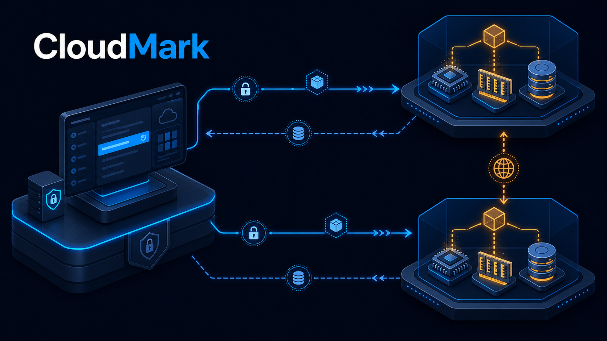

# CloudMark



CloudMark is an evidence-driven infrastructure assessment platform for cloud
instances, VPS, bare-metal servers, and self-hosted cloud environments. It
collects machine evidence, executes versioned benchmark profiles, preserves raw
results, and maps verified measurements to workload suitability.

CloudMark is designed for repeatable provider evaluation—not one-off speed
tests. Every conclusion must be traceable to a profile, tool version, topology,
timestamp, and raw result.

## Current capabilities

| Coverage | Capability |
|---|---|
| Available | Cross-platform inventory and system evidence |
| Available | AWS, Azure, and Google Cloud metadata detection |
| Available | Declared provider manifests for regional and self-hosted clouds |
| Partial | Versioned CPU integer scaling and sustained-load profiles through `sysbench` |
| Partial | Cache-resistant native memory read, write, copy, and triad bandwidth profiles |
| Available | Filesystem-safe `fio` storage profiles with latency percentiles |
| Available | Versioned job runner with progress, heartbeat, timeout, cancellation, cleanup, and partial results |
| Available | Quick, Standard, Database, Throughput, and Sustained storage profiles with one-second time series |
| Available | Local Controller API, SQLite history, and responsive dashboard |
| Available | Authenticated persistent agents, heartbeat, and durable task queues |
| Available | Explicit remote Agent dispatch for CPU, memory, and storage with live progress, cancellation, and result attribution |
| Partial | Guarded direct TCP network executor in both directions between paired agents |
| Roadmap | UDP, loaded latency, mTLS enrollment, and remaining network validity checks |
| Roadmap | Remaining CPU, memory/NUMA, GPU, application, platform, operations, and provider executors |
| Roadmap | Final workload suitability and provider scoring engine |

`Partial` and `Roadmap` capabilities never receive an artificial zero score.
The dashboard reports insufficient evidence until the required executor and
measurements are available.

## Assessment scope

CloudMark is not a storage- or network-only benchmark. Its catalog spans the
full path from machine evidence to provider operations:

| Layer | Assessment domains |
|---|---|
| Foundation | System/hardware inventory, provider identity, virtualization and topology |
| Performance | CPU/compute, memory/NUMA, storage/filesystem/object, network/connectivity, GPU/accelerators |
| Application platform | Web/API/TLS, database/cache, containers/Kubernetes |
| Trust and operations | Security/isolation, reliability/HA/DR, observability/operations |
| Provider quality | Provisioning/control plane, cost/efficiency, consistency/noisy-neighbor behavior |

These 17 technical domains feed 12 workload suitability targets. A domain can
be `Available`, `Partial`, or `Roadmap`; only collected evidence may influence a
recommendation. See the [assessment catalog](docs/ASSESSMENT_CATALOG.md) for
the planned measurements and minimum machine topology of every domain.

## Operating model

```text
Operator environment
└── CloudMark Controller + dashboard + result database

Provider environment
├── Agent A — system under assessment
└── Agent B — workload generator / peer
```

The Controller coordinates sessions and stores evidence. Provider throughput is
measured directly between agents; cloud-to-controller performance measurement
is disabled by policy. Single-system profiles can run either on the Controller
host or on an explicitly selected authenticated Agent.

## Quick start

Requirements: Python 3.9+, Node.js 22+, and pnpm.

```bash
python -m pip install -e .
pnpm install
```

Start the Controller:

```bash
python -m cloudmark serve --data-dir .cloudmark
```

Start the dashboard in a second terminal:

```bash
pnpm run dev
```

Open the local URL printed by the dashboard. Enter the token printed by the
Controller under **Controller key** before starting write operations.

## Assessment commands

```bash
python -m cloudmark inventory
python -m cloudmark doctor --packs compute,memory,storage,network,database,web
sudo python -m cloudmark bootstrap --packs compute,memory,storage,network,database,web --yes
python -m cloudmark run compute --profile compute-quick --yes
python -m cloudmark run memory --profile memory-quick --yes
python -m cloudmark run storage --profile disk-quick --yes
python -m cloudmark run storage --profile disk-database --yes
python -m cloudmark run storage --profile disk-throughput --yes
python -m cloudmark run storage --profile disk-sustained --yes
```

CPU and memory profiles deliberately saturate the selected cores. Run them on
an idle assessment system. CloudMark prevents CPU, memory, and storage
saturation jobs from overlapping locally. Memory profiles compile the packaged
C/OpenMP kernel with GCC and preserve a 512 MiB available-memory reserve. These
executors currently target Linux; results from different CPU architectures are
not treated as directly comparable.

Version `0.5.0` can dispatch single-system compute, memory, and storage suites
to an explicitly selected Agent. The Agent executes only installed CloudMark
profiles, sends progress and partial evidence to the Controller, polls operator
cancellation while a child process is active, and stops load after a bounded
control-path outage. Omitting an Agent target still executes on the Controller
host.

Storage runs use a temporary file, preserve a free-space reserve, never target
a raw device, and remove the test file after completion, failure, timeout, or
operator cancellation.

For provider-internal network measurement, create a pairing session in the
dashboard and keep one worker running on each provider VM:

```bash
cloudmark agent --controller https://CONTROLLER --session SESSION_ID --token JOIN_TOKEN --role target --advertise-address VM_A_IP
cloudmark agent --controller https://CONTROLLER --session SESSION_ID --token JOIN_TOKEN --role generator --advertise-address VM_B_IP
```

The peer executor generates traffic only between those paired addresses. The
Controller is never an iperf3 endpoint.

## Documentation

- [User guide](docs/USER_GUIDE.md)
- [Comprehensive assessment catalog](docs/ASSESSMENT_CATALOG.md)
- [Architecture](docs/ARCHITECTURE.md)
- [API](docs/API.md)
- [Disk methodology](docs/DISK_METHODOLOGY.md)
- [Compute and memory methodology](docs/COMPUTE_MEMORY_METHODOLOGY.md)
- [Remote Agent execution](docs/REMOTE_EXECUTION.md)
- [Network methodology](docs/NETWORK_METHODOLOGY.md)
- [Safety model](docs/SAFETY.md)
- [Product roadmap and machine topology matrix](docs/ROADMAP.md)

## Release status

Version `0.5.0` adds authenticated remote dispatch of CPU, memory, and storage
profiles, per-task heartbeat and cancellation, same-target load exclusion,
provider/Agent attribution, and strict result-version validation. Compute and
memory remain `Partial` until floating-point, crypto, compilation, latency,
NUMA, and broader architecture coverage are implemented. Network remains
partial until UDP, loaded latency, generator-validity checks, and mTLS
enrollment are implemented. Application and control-plane executors remain
explicitly unavailable.

## License

Apache-2.0.
